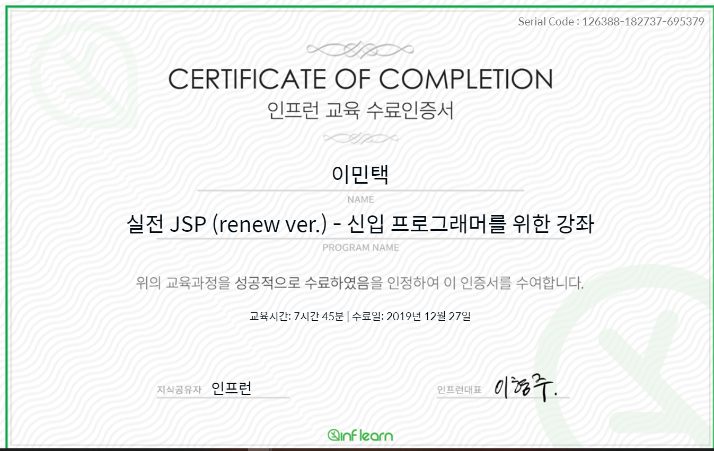

# 인프런 실전 JSP강의

[1강 웹 프로그램 개요](https://www.notion.so/1-3a6a222f4d1141b2ac5a0d1bcf2d41ae)

[2강 개발환경설정](https://www.notion.so/2-fe7ca8c39954420eaa65a38082caf917)

[3강 JSP 맛보기](https://www.notion.so/3-JSP-72c8c2d839ac48a1a6653a7937c46682)

[4강 Servlet 맛보기](https://www.notion.so/4-Servlet-11bcfe62d1df4ee890d36d2f5a3ae5c9)

[5강 Servlet맵핑](https://www.notion.so/5-Servlet-fe24fda1d6814ce1b89443313c929378)

[6강 Servlet reqeust,response](https://www.notion.so/6-Servlet-reqeust-response-b07c27e11dbb41798a62f1bc8b7a6e4c)

[7강 Servlet Life-Cycle](https://www.notion.so/7-Servlet-Life-Cycle-18782770d03f4e6c9240b13d580bdca6)

[8강 form 데이터처리](https://www.notion.so/8-form-63076b4b6224468bb0bc1b87300ec298)

[9강 JSP스크립트](https://www.notion.so/9-JSP-9b7bc02788044f4d88c22143980efbde)

[10강 JSP request,response](https://www.notion.so/10-JSP-request-response-b8c3f5dd6a304d4fb4c712c6df04353a)

[11강 jsp  내장객체](https://www.notion.so/11-jsp-7a653ef7021d4003b779e14138f3496a)

[12강 Servlet 데이터 공유](https://www.notion.so/12-Servlet-59205dec0f764f90a29f85c206157c0b)

[13강 Cookie](https://www.notion.so/13-Cookie-c0176dd7f37f4c7ea3c53543aa29b60d)

[14강 Session](https://www.notion.so/14-Session-3f662410ef8d4f1bafb015b23ad21aed)

[15강 한글 처리](https://www.notion.so/15-d16db3f12a8e4f2297966b14a97c7c6e)

[16강 오라클 설치](https://www.notion.so/16-3f4ba6b270454b9cb8a06d00f78a6058)

[17강 SQL](https://www.notion.so/17-SQL-8d8f2107e40144dbb61f8484a8ac56c0)

[18강 JDBC](https://www.notion.so/18-JDBC-8cb8eb0744b947d1a31c1dda860ee497)

[19강 DAO와 DTO](https://www.notion.so/19-DAO-DTO-3424d1a416c3482296b74ff7eeb68c5c)

[20강 connection Pool](https://www.notion.so/20-connection-Pool-19998d25387d4cdb8715cf289433be00)

